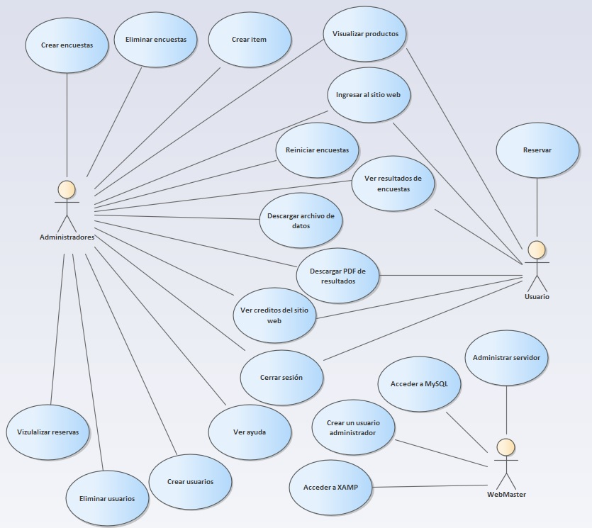

# CONTENIDO DEL TRABAJO

## INTRODUCCION

## INDICE

1. ASPECTOS DE LA ORGANIZACIÓN
    1. Mision
    2. Vision
    3. Objetivos
    4. Antecedentes
    5. Organigrama
    6. Ambito del Proyecto
        1. Area
        2. Recursos Humanos
        3. Software
        4. Hardware
        5. Cronograma de Actividades
2. ASPECTOS DEL NEGOCIO
    1. Problematica Actual o Analisis Situacional
3. METODOLOGIA
    1. Modelo de Requerimientos
        1. Cuadro de requerimientos funcionales, indicando: identificativo, nombre y descripcion.
        2. Cuadro de requerimientos no funcionales, indicando: identificativo, nombre y descripcion.
        3. Relacion de actores y su descripcion.
        4. Relacion de casos de uso.
        5. Modelo de caso de uso de requerimientos.
        6. Plantilla de especificacion de casos de uso.
        7. Matriz de trazabilidad de los requerimientos y casos de uso.
        8. Modelo Conceptual de clases
    2. Analisis Orientado a Objetos
        1. Modelo de Analisis
            1. Diagrama de analisis de clases.
            2. Diagramas de secuencia y colaboracion de analisis.
        2. Lista de Clases de Interfaz.
        3. Lista de Clases de Control.
        4. Lista de Clases de Entidades
        5. Modelo Logico de Clases.
    3. Diseño Orientado a Objetos.
        1. Modelo Fisico.
            1. Creacion de Esquema y Tablas.
        2. Estructura Modular del SWOO.
            1. Diseño de Ventanas.
            2. Diseño de Reportes.
        3. Diagrama de la Capa Presentación.
4. Diagramas de la Capa de Negocio.
        5. Diagrama de la Capa de Datos.
        6. Diagramas de Componentes.
        7. Diagramas de Distribución.

## CONCLUSIONES Y RECOMENDACIONES

## BIBLIOGRAFIA

---

 1. ASPECTOS DE LA ORGANIZACIÓN
    1. Mision

        Prestamos servicios de transporte y logística como operadores integrales atendiendo el mercado nacional e internacional, a través del desarrollo de productos de calidad, proporcionando soluciones globales y a la medida de las necesidades de nuestros clientes.

    2. Vision

        Constituirnos en la empresa líder en el mercado de transporte y logística, desarrollando nuestros recursos humanos y técnicos para alcanzar un alto estándar de calidad y diferenciación en los servicios que brindamos a nuestros clientes.

    3. Objetivos

        **Objetivo General**

        Implementar una página web para un mejor control en el inventario y gestión de ventas en la Asesoría Óptica D & R.

        **Objetivos Específicos**

        1. Analizar la gestión de venta para evitar pérdidas de la Asesoría Óptica D & R.

        2. Crear una base de datos para registrar información de la Asesoría Óptica D & R.

        3. Determinar los requerimientos del cliente para los servicios de la página web en la Asesoría Óptica D & R.

        4. Información básica que debe estar en la página web de la Asesoría Óptica D & R.

    4. Antecedentes

        **a. Antecedentes Nacionales**

        Como un antecedente nacional, según Amanqui, Y. (2020), en su proyecto de Desarrollo e implementación de un aplicativo para mejorar la gestión de mantenimiento en la empresa Lift Parts & Service S.A.C., nos muestra acerca de la idea de implementar y desarrollar una aplicación que perfeccionar el sostenimiento de la entidad Lift Parts & Service SAC.

        Otro proyecto elaborado en Lima-Perú, como el de Huancco, H. (2020), en Desarrollo e implementación de un aplicativo para mejorar la gestión médica de los afiliados en los policlínicos FEBAN, nos muestra acerca de un aplicativo que proporcione múltiples servicios a los empleados de una entidad financiera, para que sus clientes tanto aportantes como pensionistas estén afiliados en FEBAN, un programa de Asistencia Médica Ambulatoria.

        **b. Antecedentes Internacionales**

        Un antecedente internacional en México, según Peña, G. & García, Miguel Eduardo, (2014). En Diseño e implementación de una aplicación web para la gestión de información geográfica del departamento de desarrollo forestal de la CONAFOR Estado de México, nos define que su principal objetivo fue la implantación de una aplicación web que gestione información de datos que tengan vínculo con un programa que desarrolla la Comisión Nacional Forestal - CONAFOR en el ámbito forestal, enfocado en el año 2008 – 2012, visualizando un sistema cartográfico, con surgimiento de consulta de información geoespacial y alfanumérica, con potencial en la gestión de decisiones.

        En el país de Colombia, provincia de Calas encontramos a Ceballos, N. (2016), con su tesis Implementación página web para la empresa Sáner S.A.S., donde nos enseña acerca de la importancia de una implementación de página web empresarial, donde se pueda crear elementos necesarios para la empresa, previa recolección de información de lo requerido, auditado y revisado por el Gerente General.

    5. Organigrama
    

    6. Ámbito del Proyecto
        **a. Área**

        **b. Recursos Humanos**

        “La gestión de los recursos humanos del proyecto incluye los procesos que organizan, gestionan y conducen al equipo del proyecto, que está compuesto por las personas a las que se han asignado roles y responsabilidades para completar el proyecto”. (Granadino, 2016, párr. 3).

        **Rol**|**Apellidos y Nombres**|**Comportamiento**
        ---|---|---
        Gestora de proyecto|Salcedo Aranguren, Karen Lizet|Presentar proyecto al aliado.
        Administrador de Base de Datos| Zerpa Zegarra Paul Daniel| Crear la base de datos
        Programador| Flores Vives Victor Alberto|
        Analista de Sistemas|Brito Ruiz Kimberling Betsayda|
        Calidad de Software| Peña Garcia Keyla Elisa|
        Tester| Damian Solis Randy Moises|

        **c. Software**

        * Microsoft Office Word 2016
        * Microsoft Office Excel 2016
        * Netbeans
        * Microsoft Office PowerPoint 2016
        * Enterprise Architect
        * GitHub
        * Trello
        * Microsoft SQL Server Management Studio 18
        * MySQL

        d. Hardware

        e. Cronograma de Actividades

 2. Aspectos del Negocio

    **2.1. Problemática Actual**

    Anteriormente cuando las personas no eran tan exigentes con las características de un producto o servicio, las empresas no sentían la necesidad de mejorar y aumentar la calidad de los productos y servicios, en la actualidad esta representa una de las principales variables en el mercado y es precisamente lo que distingue a las empresas. La calidad es la base para la supervivencia de una empresa, la competitividad y la presencia de clientes cada vez mejor informados.

    El número de ópticas sigue aumentando año tras año. Sin embargo, también existen otros canales sustitutivos de venta que en ocasiones, hacen mucho daño al sector. Un ejemplo es el que comenta Jorge Rubio: “Respecto a las monturas de sol, cerca del 80% son vendidas en locales no autorizados”, “La venta de gafas de sol y graduadas en un todo a cien o la venta por Internet sin ningún tipo de control son prácticas cada vez más frecuentes”.

    Es por esto que ha afectado considerablemente a ASESORÍA ÓPTICA D & R , ya que siendo una empresa que lleva 3 años en el mercado ha sido difícil tener un buen reconocimiento por las personas.

    Pero con la incursión de nuevos ofertantes, las empresas comenzaron a crear sus características distintivas de la competencia. Es decir aumentar su calidad de servicio y crear diferenciadores para fidelizar clientes. En el caso de ASESORÍA ÓPTICA D & R, no solo se trata de aumentar la calidad en el servicio sino también en saber aprovechar las nuevas herramientas que ofrece el Internet para incursionar en los nuevos mercados y atraer nuevos clientes, diferenciándose de los demás establecimientos ópticos.

    El sector óptico es un sector maduro, caracterizado por una fuerte competencia en precios, donde una excelente atención al cliente es fundamental para el éxito de ASESORÍA ÓPTICA D & R, y con la incursión del Internet como herramienta importante para mercadear y promocionar productos y servicios, es allí donde ASESORÍA ÓPTICA D & R presenta falencias, aunque conoce su desventaja con ciertos competidores respecto al uso del Internet, aún no cuenta con una plataforma web digital que le ayude a posicionarse en el mercado y mejorar su relación con los clientes.

    ASESORÍA ÓPTICA D & R, decide en su afán por ser competitiva hacer uso de las herramientas que ofrece el Internet como redes sociales (facebook y twitter), sin tener un rumbo y estrategias que la orienten a su objetivo de abarcar un nuevo mercado y ser competitiva. ASESORÍA ÓPTICA D & R, ha realizado pequeñas inversiones en marketing y publicidad, como volanteo, rediseño de la imagen corporativa como tarjetas de presentación, portafolio de productos y servicios, papelería membretada, sin tener presente si habrá un retorno a esa inversión, si captó nuevos clientes o las ventas aumentaron debido a la inversión.

 3. Metodología

    **3.1. Modelo de Requerimientos**

    **3.1.1. Cuadro de Requerimientos Funcionales**

    **Identificador**|**Nombre**|**Descripción**
     :---:|:---:|:---:
    RF1|Pagina web para un mejor control|Nuestra pagina web ofrecera a los clientes un mejor control en el inventario y a la gestion de ventas so bre lso productos que la empresa ofrece
    RF2|Solicitar Pedido| Nuestra pagina web esta capacitada para poder almacenar todos los datos que ingresará el cliente
    RF3|Registrar Paciente|Nuestra pagina web se registraran los datos especificos del pedido(cantidad, tipo de producto,etc.) y también los datos personales del paciente para poder realizar el registro
    RF4|Registrar atención|El control de producción sera verificado con el formulario que el cliente llenó al inicio de todo el proceso

    **3.1.2. Cuadro de Requerimientos No Funcionales**

    **Identificador**|**Nombre**|**Descripción**
    :---:|:---:|:---:
    RNF1|Uso Factible|Nuestra pagina web no es complicada en cuanto al manejo de nuestros clientes
    RNF2|Adquiere Herramientas|Para el exito de Asesoria Optica D & R a traves del uso del internet como herramienta importante para mercadear y promocionar productos y/o servicios
    RNF3|Software|El software para el desarrollo del modelamiento sera Enterprise Architect
    RNF4|Base de Datos|El gesto de base de datos que se brindara es Microsoft SQL Server Management Studio 18

    **3.1.3. Relacion de actores y su descripción**

    **Actor**|**Asignado a**|**Responsabilidades**
    :---:|:---:|:---:
    Cliente|Realizar Registro/Reservar Cita/Visualizar Productos|El cliente solicita el servicio mediante llamada telefónica, Whatsapp o pagina web brindando sus datos e informacion personal requerida.

    **3.1.4. Relación de casos de uso**

    **Nro.** | **Caso de Uso** | **Descripción**
    :---:|:---:|:---:
    CUN01|Realizar registro|Para este caso de uso de negocio se necesita registra de manera óptima a un cliente para así poder brindar diversas funcionalidades al cliente en beneficio de ambos.
    CUN02|Reservar Cita|En este caso de uso de negocio el cliente solicita al sistema la reserva de una cita, obteniendose como respuesta la seleccion de fecha y hora disponibles de acuerdo a conveniencia del cliente.
    CUN03|Visualizar productos|El cliente interactua con el sistema, observandose diversos productos de interes, del cual el mismo podra obtener información de las diferentes caracteristicas de los productos mostrados.

    **3.1.5. Modelo de Caso de Uso de Requerimientos**

    

    **3.1.6. Plantilla de Especificación de Caso de Uso**

    Caso de uso|Pagina web para empresa Asesoria Optica D & R
    :---:|:---:
    Actores|Administradores, usuario, Webmaster
    Tipo|Primario
    Referencias|CUN01,CUN02,CUN03
    Precondición|Ninguna
    Postcondición|El sitio web tendrá un foro de ayuda al usuario
    Autores|Grupo3
    Proposito|Ayudar a la Empresa asesoría óptica D&R.
    Resumen|El usuario podrá interactuar con una página web donde habrán encuestas, información de la empresa, precios, etc.

    **3.1.7. Matriz de trazabilidad de los requerimientos y casos de uso**

***Matriz de trazabilidad de los requerimientos de sistema***

|Requerimientos|Prioridad|Estado|Dificultad|Asignado a|
|:----|:----|:----|:----|:----|
|CUS1: Registrar logueo|Alta|Propuesto|Media|Administrador|
|CUS2: Registrar cliente|Alta|Propuesto|Media|Administrador|
|CUS3: Realizar catálogo|Media|Propuesto|Alta|Adminstrador|
|CUS4: Registrar empleado|Media|Propuesto|Media|Administrador|
|CUS5: Registrar diagnóstico|Media|Propuesto|Media|Optómetra|
|CUS6: Registrar citas|Media|Propuesto|Media|Recepcionista|
|CUS7: Generar ficha de atención|Media|Propuesto|Media|Recepcionista|
|CUS8: Registrar productos|Alta|Propuesto|Media|Administrador|
|CUS9: Registrar ventas|Alta|Propuesto|Media|Administrador|
|CUS10: Consultar catálogo|Media|Propuesto|Media|Cliente|
|CUS11: Realizar pedido|Media|Propuesto|Media|Cliente|
|CUS12: Generar reportes|Baja|Propuesto|Alta|Administrador|
|CUS13: Generar comprobantes de pago|Media|Propuesto|Media|Recepcionista|
|CUS14: imprimir documentos|Baja|Propuesto|Media|Recepcionista|
|CUS15: Generar ficha de atención|Media|Propuesto|Media|Recepcionista|
|CUS16: Realizar inventario|Alta|Propuesto|Alta|Administrador|

***Matiz de trazabilidad de casos de uso y actores***

|Relaciones |CUS1: Registrar logueo|CUS2: Registrar cliente|CUS3: Realizar catálogo|CUS4: Registrar empleado|CUS5: Registrar diagnóstico|CUS6: Registrar citas|CUS7: Generar ficha de atención|CUS8: Registrar productos|CUS9: Registrar ventas|CUS10: Consultar catálogo|CUS11: Realizar pedido|CUS12: Generar reportes|CUS13: Generar comprobantes de pago|CUS14: imprimir documentos|CUS15: Generar ficha de atención|CUS16: Realizar inventario|
|:----|:----|:----|:----|:----|:----|:----|:----|:----|:----|:----|:----|:----|:----|:----|:----|:----|
|ACT1: Administrador|✔|✔|✔|✔| | | |✔|✔| | |✔| | | |✔|
|ACT2: Optómetra| | | | |✔| | | | | | | | | | | |
|ACT3: Recepcionista| | | | | |✔|✔| | | | | |✔|✔|✔| |
|ACT4: Cliente| | | | | | | | | |✔|✔| | | | | |

3.1.8. Modelo Conceptual de clases

